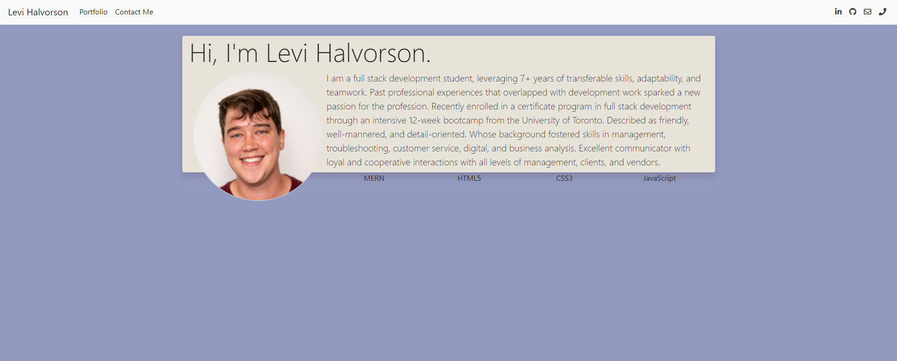

# My Portfolio

This is my portfolio where I showcase my favorite projects and shows all my contacts!

## 🍔 Getting started

## 💥 Issues

The main challenges were deploying this to gh pages.

## 👌 Collaborators

With instruction from [Filipe Laborde-Basto](https://github.com/c0dehot) and [Daniel Cabellos](https://github.com/shibeknight)

## ☕ License:

For more information about the license, click on the link below.

- [License](https://choosealicense.com/licenses/mit/)

## ❔ Questions:

For questions about this project you can go to my GitHub page at the following link:

- [GitHub Profile](https://github.com/Halvosaurus34)

For additional questions please reach out to me at: lhalvorson34@gmail.com.

---

## 🎯 Links

[Deployed Portfolio Website](https://halvosaurus34.github.io/Portfolio/#/)

---

[Portfolio GitHub Repository](https://github.com/Halvosaurus34/Portfolio)

---

I used [React](https://reactjs.org/) and [Bootstrap](https://getbootstrap.com/) to build this web app.

---

## 👀 Screenshot

